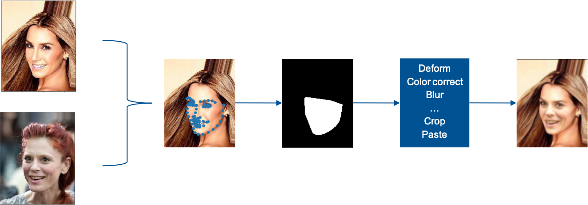

**Overall Structure**

1. X-Ray Data Generator: contains all requirements for creating fake data with image processing steps. See description below for more info
2. XraySimpleDemo: contains simple Xray creation pipeline and demo notebook
3. XrayDemo: contains Demo of actual processing steps that are used in our final generation pipeline
4. Backup: contains Face-Artifacts approach for image processing and data generation. The approach in there uses face warping instead of looking for similar faces in a database. This was for prototyping and experimenting only - not used in the end.

**Face-Xray approach:**

Ref:
- https://github.com/AlgoHunt/Face-Xray
- https://github.com/neverUseThisName/Face-X-Ray

Given: images of faces, in best case same image sizes and somehow centered

Goal: Given two images, select face region from first one, do some transformations to the select face mask and paste it to second image

Steps: paste face B to A
1. get landmarks from Face A
2. Search for most similar face in given data collection --> face B
3. from landmarks from A, get hull --> mask (region to extract pixels from)
4. deform the mask (piecwise affine transform, blurr, etc.)
5. color correct image B to A
7. since our images are as similar as possible given the landmarks: use deformed mask from A to extract pixels from B and paste to A (faceswap)

The more complex paper has additional steps:

8. down and up sample again
9. use jpeg comrpession

Here is the pipeline drawn for illustration purposes:

The more complex paper also experiments with different Mask formation algorithms, given the facial landmarks

See Notebooks for reference

**Face-Artifacts approach:**

Ref: https://github.com/yuezunli/CVPRW2019_Face_Artifacts

Similar transformation and mask generation etc.

But instead of step 2. from before (searching for most similar face), the landmarks of ALL faces are transformed into a normalized space (such that all images look similar)
--> I don't know how well this approach works, I still need to test this
