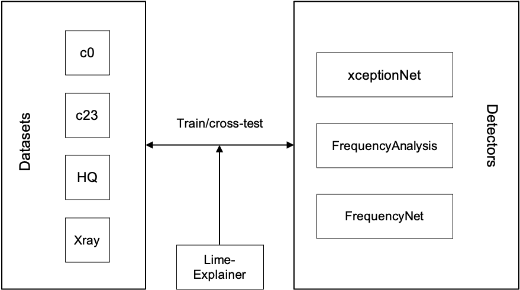

# Deep Fake Generation and Detection
## Overview

In this project, we analyzed and recreated the main challenges in the task of Deep Fake Detection. The project setup can be seen in the figure above.

### Database
In order to analyze the abalitiy of generalizing to unseen images, we needed to have different datasets consisting real and fake images. The latter ones should best be attained by different methods. The idea is that deep fake detectors usually overfit on the generation methods that are given by the dataset. We therefore created 4 different datasets:
- c0 and c23: adapter from FaceForensics++ (http://www.niessnerlab.org/projects/roessler2019faceforensicspp.html). See directory FaceForensicsDataset for details.
- HQ: Downloaded (publicly available, generated by Style-GANs)
- Xray: used method described in "Face X-ray for More General Face Forgery Detection, Li et al" (https://github.com/AlgoHunt/Face-Xray#readme). See directory FaceBlending for own adaptions and analysis.

All our datasets can be downloaded here: https://syncandshare.lrz.de/getlink/fiWJXehJXqESXNxopXNUYyNA/

### Detectors
In order to make a comparative analysis, we decided to take 2 different methods. One of them is blackbox (complex CNN that find features itself), the other one is based on image frequency features (we adapted two versions: SVM vs NN).
- XceptionNet: adapted from FaceForensics++ (http://www.niessnerlab.org/projects/roessler2019faceforensicspp.html), see XceptionNet directory for adaptions.
- FrequencyAnalyzer: adapted from Unmasking DeepFakes with simple Features, Durall et al. (https://arxiv.org/abs/1911.00686). See Directory frequency_analysis. For the frequency analyzers, we also have some pipeline that easily cross-tests between the different datasets.

### Explainer
We also used the Lime Explainer (https://github.com/marcotcr/lime) in order to understand the predictions made for different model-train_data combinations. The directory explainer contains all code relevant for this part

Some of the explain data can be downloaded here: https://syncandshare.lrz.de/getlink/fiWJXehJXqESXNxopXNUYyNA/
(note that the explanations took quite some time. Due to shared resources on the server, we did not finish all explanations. But we got an overall idea and think this should be enough.)

## Requirements
To run this project, please install the following:
- python 3.7
- `pytorch==1.9.0+cu102` with `torchvision==0.10.0+cu102`
- requirements.txt
