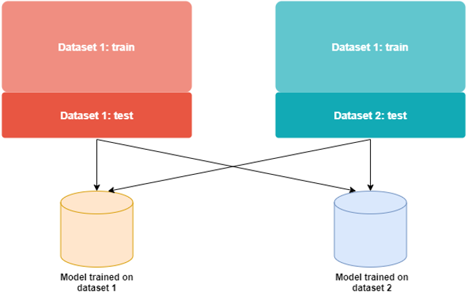

# Frequency Solver
DeepFake detection using the frequency spectrum as input. 
This is inspired and based on the work of Durall *et al.*  in [Unmasking Deepfakes with simple Features](https://github.com/cc-hpc-itwm/DeepFakeDetection). 

The goal of this framework is to offer an easy and accessible platform for performing experiments in different settings.
It supports computing the input features from the images, training two classifiers - an **SVM with radial kernel** and a **fully connected NN** and testing to determine the accuracy of the classifier. 

## 1. Theoretical Background
This is a short introduction. For more details, we refer to [Frequency Jupyter Notebook]() explaining all the steps sequentially. 

### To get the input features:
- Crop face area of the image
- Apply the 2D Fourier Transform on the input image. Result will be again two dimensional.
- Compute the magnitude/power in the Fourier domain
- Compute the azimuthal average to get a **one dimensional** input vector 


After this, you can train the SVM/NN with the input features vector. 
- svm uses a radial kernel
- nn is a simple model with 4 fully-connected layers
## 2. Project structure

The framework contains:
- `classiy.py`, script for computing features and training
- directory `libs`, contains the code for the classifiers, dataloaders, helper functions etc.
- directory `data`, contains subdirectories `features`(computed train/test input features) and `models`(trained models)
- Jupyter Notebook?

Datasets:
- for training, each dataset should have two subfolders `train` and `test`
- both `train` and `test` should be divided in `real` and `fake` 

## 3. Running the experiments 

To run `classify.py`, the following flags are available:
```shell
--num_files <integer>, number of images to use for training 
--num_features <integer>, number of input features to compute from images
--data_path <string>, path to dataset for training and testing, if set to None 
it will use the files given to --training_features and/or test_features
--training_features <string>, .pkl file with precomputed training features, will look into ./data/features, 
if flag is None new features will be computed 
--test_features <string>, .pkl file with precomputed test features
--save_features <string>, give a name for a .pkl file for saving trianing features,
will place the features in ./data/features
--save_test_features <string>, give a name for a .pkl file for saving test features,
will place the features in ./data/features
--solver <string>, default to "svm", set it to "nn" if you want to train using NN
--save_results <bool>, default to False, set to True if you want to save accuracy in ./data/results.txt
```

Output:
- the accuracy of the trained model on the given testset as console output
- a pretrained model in ./data/model, a .pkl file for svm and a .ckpt file for nn
- is save flags are set, features/results are saved accordingly 

## 4. Training and Testing

Here are a few examples of using the framework. We assume that we are running from the terminal. 

**1. Training the svm from scratch using a new dataset.**

`python3 -m classify --num_files 3000 --data_path <path_to_dataset>`
   - This will train a new project with images from `<path_to_dataset>/train` and test with images 
from `<path_to_dataset>/test` 
     
- It will use for training 3000 real images and 3000 fake images (6000 in total)
- It will automatically save in `./models` the trained model 

**2. Training the nn from scratch with a new dataset.** 
`python3 -m classify --num_files 3000 --data_path <path_to_dataset> --solver nn`
   
- Same as above, but set the flag `--solver` to "nn"

**3. Train from scratch and save training features for later use** 
`python3 -m classify --num_files 3000 --data_path <path_to_dataset> --save_features svm_train.pkl`
   
- same as above and you can save the features used for training in `./data/features`

**4. Train from scratch and save test features**
`python3 -m classify --num_files 3000 --data_path <path_to_dataset> --save_test_features svm_test.pkl`

**5. Train using precomputed train and test features** 
- assume the precomputed train features of the dataset X-ray are `xray_train.pkl` and the 
precomputed test features of the same dataset are `xray_test.pkl```

`pythron3 -m classify --training_features xray_train.pkl --test_features xray_test.pkl`


All of the five example will output a trained model. Note that for really big datasets (c0, c23) the svm might take a while to train. 

Attention! There is one case that is not working: the case when you already have precomputed training features 
`--training_set <pkl_file>` but want to compute new test features is not working. We never came across this particular case. 

**6. Cross-testing** 
To perform crosstesting as visualized as follows



we created a script **crosstest.py** that handles this. One solely needs a directory that contains the test data frequency features as pickle files, and a directory that contains the different frequency models (trained on different training data).

These two paths can be specified at the top of the file:
model_path = "xyz"
data_path = "abc"


## 5. Example: Training on X-ray dataset 

First, we want to train from the scratch using the svm and save the computed features. 

`python3 -m classify --num_files 7000 --data_path <path_to_xray_dataset> --save_features xray_train_ex.pkl --save_test_features xray_test_ex.pkl`

- We will use 7000 reals and 7000 deepfakes for training and the entire test set (this is default and it can't be changed)
- We'll save the training features in `./data/features/xray_train_ex.pkl`
- We'll save the test features in `./data/features/xray_test_ex.pkl`
- The pretrained model `freq_SVM_XRray-dataset.pkl` will be saved in `./data/models`

Next, we want to train the Freq NN on the same dataset. To save time, we can use the precomputed input features saved as pickle object.

`python3 -m classify --training_features  xray_train_ex.pkl --test_features xray_test_ex.pkl --solver nn`

This allows great flexibility in training under different conditions. 
The pretrained models can then be used for explainability and for cross-testing. 


